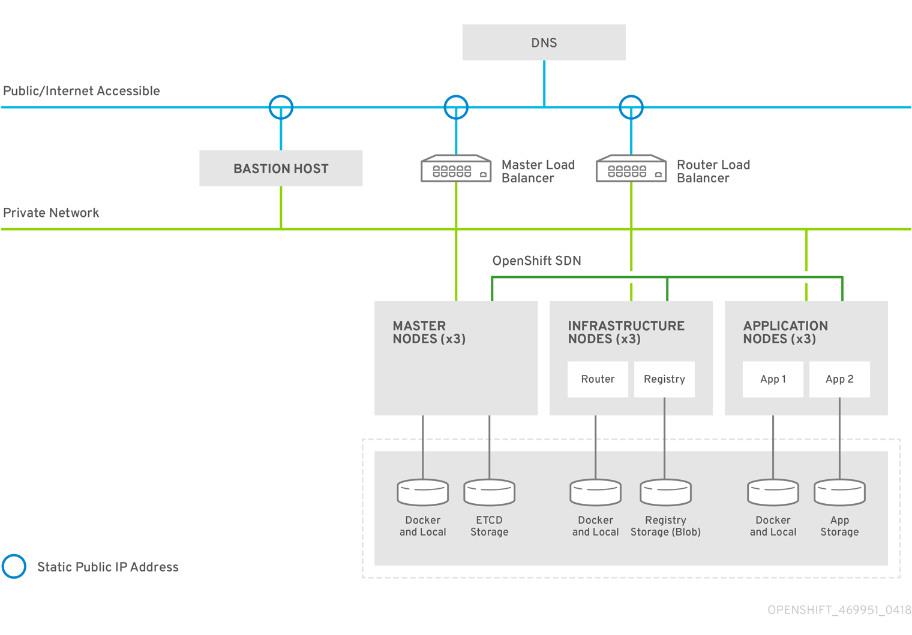

# RedHat Openshift (OKD) 3.11 on Azure

This repository contains Azure CLI and Bash Scripts to automate the deployment
of OKD 3.11 to Azure.  We needed a proper end-to-end solution for the
automated / on-demand provisioning of multiple clusters.

The deployment described in this repository tries to stick as closely as
possible to the official Reference Architecture and documentation as possible.
Bugs, where known for 3.11 and deployment of 3.11, are documented with
reference links to the original Github issues, and work-arounds, fixes and
Redhat advisories are taken into account in the deployment described in this
repository.

Note: The official MSFT template is maintained at
[https://github.com/openshift/openshift-azure](https://github.com/openshift
/openshift-azure) for an older version of Openshift 3.9.


## Architecture
By default, this repository deploys the OKD reference architecture.



- All components are grouped within a single `Resource Group`
- One `VNet` with two `Subnets`
- One `Bastion` host within a `DMZ Subnet`
- Three `Master`, three `Infrastructure` and three `Agent` nodes within a `Private Subnet`
- Each `Subnet` is guarded by a `Network Security Group`

## Configuration
You can customize the following components of the deployment by editing `00-configuration.sh`:

- `LOCATION` the Azure region for the cluster
- `CLUSTER_NAME` the name of the cluster, e.g., `production`, or `sandbox`
- `DNS_DOMAIN` the TLD from which DNS names will be derived for the cluster, e.g., `my-company.com`
- `USERNAME` the username for the web console / API user
- `PASSWORD` a hashed password, generated with the `htpasswd` tool for the web console / API user
- `DMZ_SUBNET_CIDR` the CIDR range for the DMZ Subnet containing the bastion host
- `PRIVATE_SUBNET_CIDR` the CIDR range for the Private Subnet containing master, infrastructure and application nodes
- `MASTER_INSTANCE_COUNT` the number of master nodes, should be 1, 3, 5 or 7. Defaults to 3.
- `MASTER_INSTANCE_SIZE` the Azure SKU for the Virtual Machine, defaults to `Standard_D4s_v3`
- `MASTER_INSTANCE_IMAGE` the Azure SKU for the Virtual Machine image to use, defaults to `OpenLogic:CentOS:7.6:latest`
- `INFRASTRUCTURE_INSTANCE_COUNT` the number of infrastructure nodes, should be 1, 3, 5 or 7. Defaults to 3.
- `INFRASTRUCTURE_INSTANCE_SIZE` the Azure SKU for the Virtual Machine, defaults to `Standard_D4s_v3`
- `INFRASTRUCTURE_INSTANCE_IMAGE` the Azure SKU for the Virtual Machine image to use, defaults to `OpenLogic:CentOS:7.6:latest`
- `APPLICATION_INSTANCE_COUNT` the number of applications nodes, should be 1, 3, 5 or 7. Defaults to 3.
- `APPLICATION_INSTANCE_SIZE` the Azure SKU for the Virtual Machine, defaults to `Standard_D4s_v3`
- `APPLICATION_INSTANCE_IMAGE` the Azure SKU for the Virtual Machine image to use, defaults to `OpenLogic:CentOS:7.6:latest`
- `STORAGE_KIND` the cluster storage type to use, defaults to `StorageV2`
- `STORAGE_SKU` the Azure SKU for the storage type, defaults to `Standard_LRS`
- `STORAGE_ACCOUNT_NAME` a subscription unique name to identify the storage account for the cluster, defaults to `okdstoragelrs01`
- `REDHAT_REGISTRY_USERNAME` a username to use to access the RedHat Docker Registry (for image streams)
- `REDHAT_REGISTRY_PASSWORD` a password to use to access the RedHat Docker Registry

## Openshift-Specific Customization

You can further customize `lib/ansible-inventory.template` to provide Openshift specific options.

## Usage

Deployment is simple, first edit `00-configuration.sh` to your liking, then run `./deploy.sh`. 

## SSH Access to Bastion Host

The deployment logs will list `BASTION_IP` - the public IP address of the bastion host. 

If you missed the output, you can find the IP 
with the following command:

```
az vm show --name okd-bastion -g ${OPENSHIFT_RG} -d --query publicIps | sed -e 's/"//g'
``` 

Use the generated SSH Keypair, located in `./ssh/okd_rsa` to access this host as user `okd`.

## Ansible Provisioning

After the infrastructure is set up, you can either uncomment the following lines in `05-provision-nodes.sh` or run the commands directly on the bastion host.
```
# Execute Openshift Ansible Playbooks
# execute-remote-cmd okd-bastion 'ansible-playbook /usr/share/ansible/openshift-ansible/playbooks/prerequisites.yml'
# execute-remote-cmd okd-bastion 'ansible-playbook /usr/share/ansible/openshift-ansible/playbooks/deploy_cluster.yml'
```

Note: If Ansible Deployment hangs during `Verifying Control Plane is Up` step, make sure you have your DNS entry for `DNS_MASTER_NAME` (`master.${CLUSTER_NAME}-${LOCATION}.${DNS_DOMAIN}`)
pointing to the `master-lb-public-ip` address.

## Verify Everything Is Working

You can either uncomment the following lines in `05-provision-nodes.sh` or run the commands directly on the bastion host.

```
# Verify Install
# execute-remote-cmd okd-master-1 'oc get nodes'
# execute-remote-cmd okd-master-1 'oc get nodes --show-labels=true'
```

## Post Install Fixes / Bugs

### Service Broker Failing with 404 to /osb/ path

Change `ansible_service_broker_image` in the `asb` `DeploymentConfig` to `docker.io/ansibleplaybookbundle/origin-ansible-service-broker:ansible-service-broker-1.2.17-1`

- [https://github.com/openshift/openshift-ansible/issues/9960](https://github.com/openshift/openshift-ansible/issues/9960)
- [https://github.com/openshift/origin/issues/18332#issuecomment-420099823](https://github.com/openshift/origin/issues/18332#issuecomment-420099823)
- [https://hub.docker.com/r/ansibleplaybookbundle/origin-ansible-service-broker/tags?page=1](https://hub.docker.com/r/ansibleplaybookbundle/origin-ansible-service-broker/tags?page=1)


### Cluster Console Redirect Loop
Run `oc delete pod -n openshift-console -l app=openshift-console` on a master node.
- [http://blog.andyserver.com/2018/10/enabling-the-openshift-cluster-console-in-minishift/](http://blog.andyserver.com/2018/10/enabling-the-openshift-cluster-console-in-minishift/)


